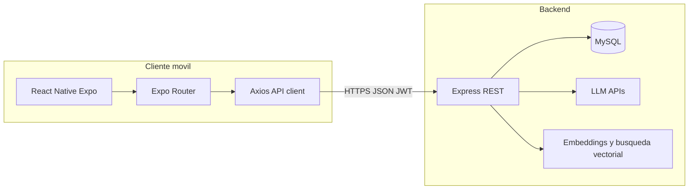
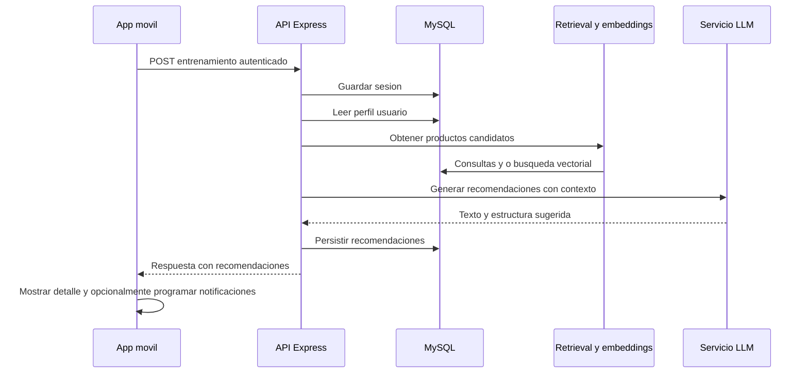

# Descripción de alto nivel del sistema Sport / SIS (aplicación móvil + backend)

Documento orientado a la redacción de tesis: **qué hace la aplicación**, **stack tecnológico central** y **funcionalidades principales**. Los aspectos secundarios o de soporte se indican de forma breve al final.

---

## 1. Qué es la aplicación (lenguaje de alto nivel)

La aplicación es un **sistema de apoyo al deportista** que combina:

1. **Gestión de usuario y perfil deportivo-nutricional** (datos personales, objetivos, hábitos y restricciones).
2. **Catálogo de productos** (suplementos u otros ítems modelados en base de datos) con información nutricional, sabores y atributos.
3. **Registro de sesiones de entrenamiento** (fecha, duración, intensidad, tipo de actividad, contexto como clima o notas).
4. **Motor de recomendaciones** que, a partir del **perfil del usuario** y del **contexto del entrenamiento**, propone **productos** y **orientación de consumo** (p. ej. momentos relativos al ejercicio), apoyándose en **recuperación de información** sobre productos y en **modelos de lenguaje (LLM)** en el backend.

En conjunto, el sistema pretende **personalizar sugerencias** de suplementación o consumo alineadas al perfil y al entrenamiento registrado, en lugar de ofrecer un catálogo genérico sin contexto.

---

## 2. Arquitectura general

- **Cliente**: aplicación móvil multiplataforma (iOS / Android; posible compilación web vía React Native Web) desarrollada con **Expo** y **React Native**.
- **Servidor**: API **REST** en **Node.js** con **Express**, persistencia en **MySQL** (vía `mysql2`), autenticación con **JWT** y contraseñas hasheadas (**bcryptjs**).
- **Inteligencia / recomendación**: servicios que integran **APIs de modelos de lenguaje** (p. ej. OpenAI y/o Google Generative AI según dependencias del backend) y lógica de **recuperación de candidatos** (incluyendo búsqueda vectorial/embeddings cuando está configurado).

---

## 3. Tecnologías core (frontend)

| Tecnología | Rol |
|------------|-----|
| **React 19** + **React Native 0.81** | UI declarativa y componentes nativos. |
| **Expo SDK ~54** | Toolchain, build, constantes, plugins. |
| **Expo Router ~6** | Navegación basada en archivos (`app/`), rutas anidadas y tabs. |
| **TypeScript** | Tipado en cliente. |
| **Axios** | Cliente HTTP hacia `/api` con interceptores (token, errores de red). |
| **AsyncStorage** | Persistencia local de sesión (`user`, `token`). |
| **React Navigation** (tabs/stack, vía Expo) | Navegación inferior y encabezados donde aplica. |
| **react-native-gesture-handler** + **reanimated** | Gestos y animaciones (p. ej. swipe en listas). |
| **expo-notifications** | Programación de recordatorios locales relacionados con consumo. |

**Diseño / UX en código**: sistema de **tokens de diseño** centralizado en `src/theme` (colores, espaciado, tipografía referencial), sin motor CSS web clásico: estilos con `StyleSheet` de React Native.

---

## 4. Tecnologías core (backend)

| Tecnología | Rol |
|------------|-----|
| **Node.js** + **Express 4** | API REST, middleware CORS, JSON. |
| **MySQL** (`mysql2`) | Datos de usuarios, perfiles, productos, entrenamientos, recomendaciones, feedback. |
| **jsonwebtoken** | Autenticación stateless (Bearer). |
| **bcryptjs** | Hash de contraseñas. |
| **dotenv** | Configuración por entorno. |
| **express-rate-limit** | Limitación de peticiones (seguridad/estabilidad). |
| **OpenAI** / **@google/generative-ai** | Integración con LLM para razonamiento y texto de recomendación (según implementación en `services/llmService.js` y afines). |
| **Embeddings / vector search** (módulos en `services/`) | Recuperación de productos candidatos más relevantes para el contexto. |

---

## 5. Funcionalidades core (descripción funcional)

### 5.1 Autenticación y sesión

- Registro e inicio de sesión (email/contraseña).
- Almacenamiento del **JWT** y datos mínimos de usuario en el dispositivo.
- Rutas protegidas: la app redirige según exista sesión y **perfil completado** o no (`AuthContext` + Expo Router).

### 5.2 Perfil de usuario (sport / nutrición)

- Creación y edición de un **perfil enriquecido**: datos demográficos, nivel de actividad, frecuencia de entrenamiento, objetivo principal, sudoración, tolerancia a cafeína, restricciones dietéticas, etc.
- Este perfil es la base para **filtrar y contextualizar** recomendaciones en el backend.

### 5.3 Productos

- Listado con **categorías**, **búsqueda**, **filtros** (p. ej. timing de consumo) y **paginación** desde el cliente.
- **Detalle de producto**: descripción, recomendaciones de uso, sabores, información nutricional y atributos/beneficios según lo expuesto por la API.

### 5.4 Entrenamientos

- **Alta de sesión**: fecha, hora, duración, intensidad, tipo (cardio, fuerza, etc.), tipo de deporte, clima, notas.
- **Listado** de sesiones con posibilidad de **eliminar** (gesto swipe) y **abrir detalle**.
- Tras crear una sesión, el backend puede **generar recomendaciones** ligadas a esa sesión (productos + texto explicativo + datos de timing de consumo).

### 5.5 Recomendaciones

- Visualización de recomendaciones **positivas** (útiles) y registro de **feedback** (útil / no útil) hacia el backend.
- Las recomendaciones se apoyan en: **perfil**, **datos del entrenamiento**, **recuperación de productos candidatos** y **salida del LLM** para redactar y ajustar sugerencias.

### 5.6 Notificaciones locales

- Preferencias de usuario para recordatorios (p. ej. consumo) y **programación** de notificaciones locales en función de las recomendaciones y horarios de sesión (integración `expo-notifications` + servicio en cliente).

### 5.7 Tema visual y experiencia de uso

- Interfaz **oscura** con acentos metálicos/dorados suaves, componentes reutilizables (botones, formularios, estados vacíos, skeletons de carga, banner de error de red).

---

## 6. Flujo de datos típico (recomendación post-entrenamiento)

---

## 7. Aspectos secundarios (visión rápida)

- **Internacionalización**: textos principalmente en español en UI; fechas formateadas con `date-fns` / `toLocaleDateString` donde aplica.
- **Manejo de errores de red**: banner global y mensajes en formularios.
- **Pantallas auxiliares**: carga de perfil, 404 de Expo Router, pantallas de error vacío.
- **Testing**: Jest configurado en el frontend; tests automatizados del backend no descritos en `package.json` por defecto.
- **Despliegue**: no forma parte del núcleo del código; la URL del API se configura vía Expo (`extra.apiUrl`) o valor por defecto en desarrollo.

---

## 8. Cómo citar o referenciar en la tesis

- Puede describirse como **aplicación móvil híbrida (React Native / Expo)** que consume una **API REST en Node.js** con **MySQL**, incorporando **recomendación asistida por LLM** y **recuperación de información** sobre catálogo de productos.
- El nombre comercial o de proyecto en código aparece como **appsport** / interfaz de usuario orientada a la marca **SIS** en textos de la app.

---

*Documento generado a partir de la estructura de repositorios `Sport-Funcional` (cliente) y `SportBack-funcionalBack` (servidor). Ajustar nombres formales del trabajo académico y referencias bibliográficas de frameworks según normativa de la institución.*
